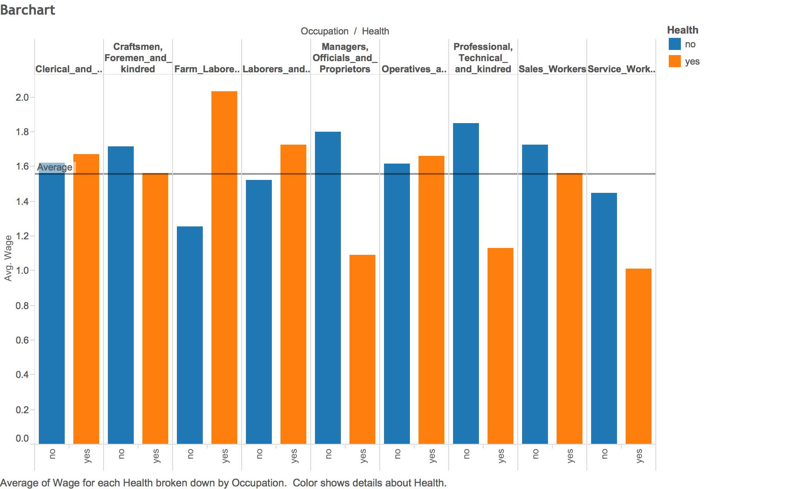

## First, thank you for a great semester!

## Dr Cannata's Tableau Methodology:
***To analyze a Data Source:***  
1. Start with a green thing (usually a Measure) in non-aggregated mode and make a Boxplot  
2. Start with a green thing in aggregated mode and make a Histogram  
3. Start with 2 green things and make a Scatter plot  
4. Start with two blue things (usually Dimensions) plus a green thing and make a Crosstab  
5. Start with a blue thing and a green thing and make a Barchart  

## Link to our Shiny App:
*Click Here: https://jonong.shinyapps.io/FinalProjectShiny

## Our Datasets:
***Males***  
*Dataset Males contains the data of young males and their job-related information including years of schooling, work experience, and industry between the years 1980-1987.  

***LaborSupply***  
*Dataset LaborSupply contains job statistics such as natural log of hours worked and natural log of wage between the years 1979-1987.  

## Step 1: Create histogram in Tableau
*The histogram shows the distribution of experience levels in the data set (in years). The distribution is positively skewed with a long tail on the right. A majority of the participants had between two and nine years of experience.

***Process (Tableau)***  
1. Select exper from "measures"  
2. Click "Show Me"  
3. Select "Histogram"  
4. Enjoy result  

## Step 2: Create scatterplot

*The visualization below shows that between the ages of 11 and 14, there is the most variability in wages. The people with the highest wages are in this range, but so are the people with the lowest wages. 

***Process (Tableau)***  
1. Drag "School" into columns  
2. Drag "Wage" into rows  
3. Drag "Occupation" into colors  

***Process (Shiny)***  
1. Extract SQL query using json statement  
2. Copy and paste R code from Project 5  

## Step 3: Create crosstab
*What stood out in the data is the blacks were most experienced as laborers and farmers, as well as managers, officials and proprietors in the professional and related service industry and public administration industry compared to Hispanics, and other racial ethnicities including White people, Asians, and Native Americans. 

***Process (Tableau)***  
1. Drag "Industry" into columns  
2. Drag "Occupation" and "Ethnicity" into rows  
3. Drag "Experience" into text and change measure into average  
4. Create KPI called "Max Low KPI". Data type is float and current value is 7.  
5. Create KPI called "Max Median KPI". Data type is float and current value is 10.  
6. Create "Calculated KPI" with the following if statement:  

if AVG([Exper]) <= [Max Low KPI] then 'Low'  
elseif AVG([Exper]) <= [Max Median KPI] then 'Medium'  
else 'High'  
end  

7. Drag Calculated KPI to color.  

***Process (Shiny)***  
1. Create code for reactive class for KPI  
2. Extract SQL query using json statement  
3. Copy and paste R code from Project 5  

## Step 4: Create barchart
*The visualization below shows that higher pay in more physical jobs have a higher correlation with health problems. This could suggest that success in physical jobs takes a toll on the body.

***Process (Tableau)***  
1. Drag "Occupation" and "Health" into columns  
2. Drag "Wage" into rows and make the measure a median  
3. Drag "Health" to color  
4. Add reference line for entire table  

***Process (Shiny)***  
1. Extract SQL query using json statement  
2. Copy and paste R code from Project 5  

## Step 5: Create datablend of two datasets
*Although from 1980 to 1987, number of hours worked stay the same on average, however the wages of young males increased. 

***Process (Tableau)***  
1. Extract laborsupply.csv as a datasource  
2. Go to "data", "edit relationships", "custom", and add year  
2. Drag "year" and "measure names" to rows  
3. Drag "measure values" to columns  

***Process (Shiny)***  
1. Extract SQL query using json statement  
2. Copy and paste R code from Project 5  

## Step 6: Create visualization for boxplot
*The visualization shows that for industries such as transportation and business the variance of experience is much larger than industries such as mining and finance. This could suggest that there are certain careers that have a higher retention rate. 

***Process (Tableau)***  
1. Uncheck "Aggregate Measures" under "Analysis"  
2. Drag "Industry" from Dimensions into columns  
3. Drag "Exper" from Measures into rows  
4. Click "Show Me"  
5. Select Box Plot  
6. Drag "Ethn" onto color  

## Step 7: Write code for ui.R

***Process***  
1. Create the navigation bar title  
2. Create tab for scatterplot and create sliders to adjust width and height 
3. Create tab for crosstab and scale for KPI, width, height, and label size. Also create a button to make crosstab appear.  
4. Create tab for barchart and scale for label size and width  
5. Create tab for datablend and create sliders to adjust width and height  

## Limitations
****We recognize that there are certain limitations to our data.***  
1. The only races that are broken out are Blacks and Hispanics. This limited our possibilities for analysis  
2. The data is dated from 1980-1987, which means it is not an accurate representation of today's labor market  
3. Geographically, the survey contains more respondents from the North, slightly skewing our data  

## THANK YOU ONCE AGAIN!
